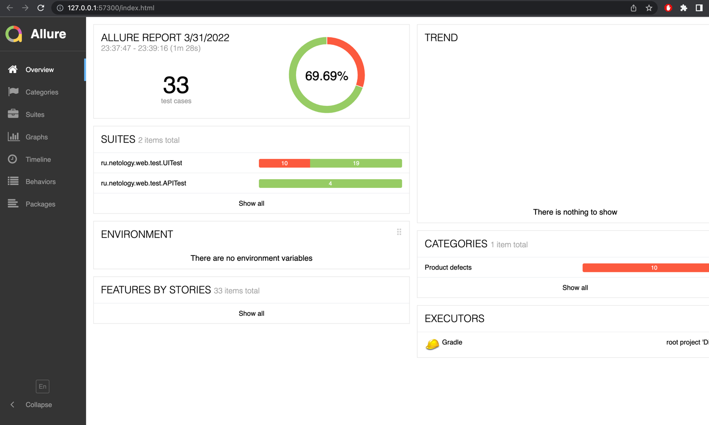

## Отчёт по итогам тестирования

Описание:
Тесты проводились по покупке тура по карте и в кредит
(были использованы как позитивные, так и негативные сценарии).

Количество тестов:

Всего было проверено 33 тест-кейса, из которых:
23 (~70%) - успешны.
10 (~30%) - не успешны.

Общие рекомендации:
- Исправить орфографические ошибки и заголовок страницы.
- Убрать информационные сообщения о неверном формате после исправления значения, вводимого в поле.
- Исправить баг с покупкой по невалидной карте.
- Решить проблему с полем "Владелец" (ввод на английском языке с именем и фамилией владельца карты).

